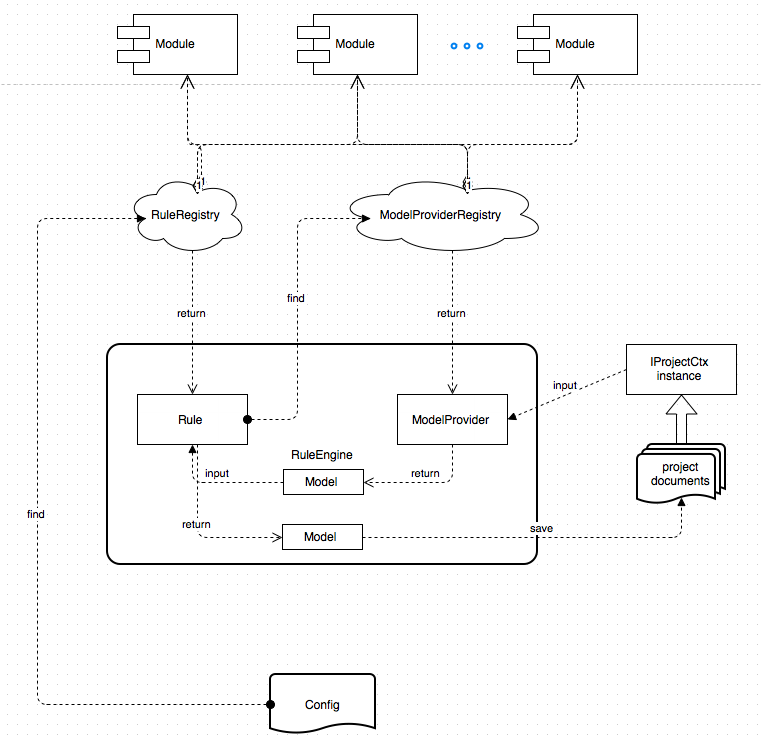
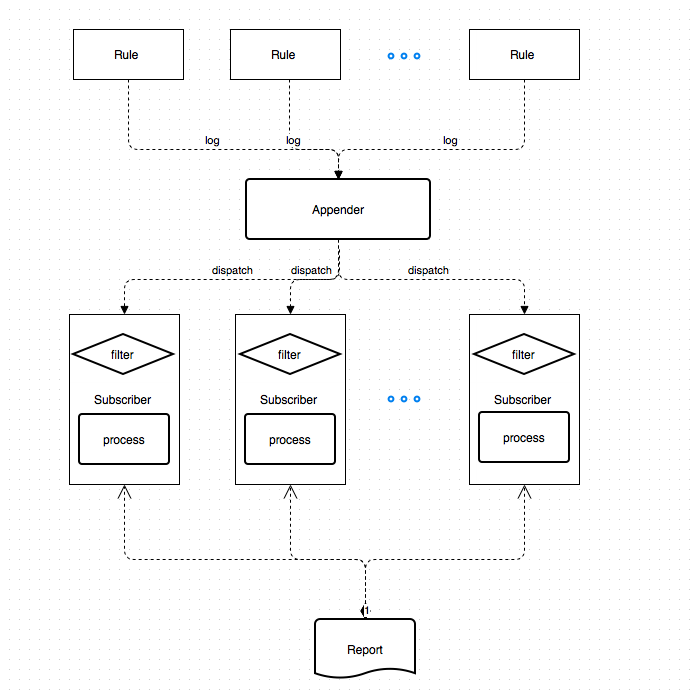

# RTran: Rule Based Project Transformer

[](LICENSE.txt)
[](https://www.codacy.com/app/zcx-wang/RTran)

The library executes a sequence of rules on a physical project (directories and files on disk). 
The idea is to support continuously upgrade projects to catch up the latest framework. 
Unlike a one-time upgrade script, rules in Rtran can be implemented in a generic way and able to take configuration. 
Therefore, for structured project like Maven, a lot of rules can be reused once it's implemented.

## Terminology

___Project context___: reflects the project to in-memory data (implements `org.rtran.api.IProjectCtx`) 

___Model___: a specific data type that extracted from project context (implements `org.rtran.api.IModel`)

___Model provider___: the factory that produce a Model instance from project context (implements `org.rtran.api.IModelProvider`)

___Rule config___: an implementation of `org.rtran.api.IRuleConfig` which usually will be un/marshallable

___Rule definition___: an implementation of `org.rtran.api.IRule` which may take 0 or 1 rule config parameter

___Rule instance___: basic unit executed by the engine which is created from rule definition with certain rule config
                
## Rule Engine Overview

### Architecture



Rule definitions and model providers can be registered in different modules (JARs) by having a src/resources/META-INF/rtran-meta.conf file.

Here is the example (We use HOCON as the syntax of the .conf file):

```
   // list of IModelProvider implementations
   upgrader.model-providers = [
     org.rtran.generic.AllFilesModelProvider
     org.rtran.xml.XMLFilesModelProvider
   ]
   
   // rule definitions keyed by unique rule name
   upgrader.rules {
     "ModifyXMLFilesRule" = {
       // implementation of IRule
       class = org.rtran.xml.ModifyXMLFilesRule
       // the factory class that create the IRuleConfig instance with certain raw data
       // if not specified, the IRuleConfig implementation will be a scala case class and raw data is a JsonNode
       config-factory = org.rtran.xml.ModifyXMLFilesRuleConfigFactory
     }
     "MoveFilesRule" = {
       class = org.rtran.generic.MoveFilesRule
     }
     "ModifyFilesRule" = {
       class = org.rtran.generic.ModifyFilesRule
     }
   }
```

An external configuration, usually JSON style data can be accepted. Basically it will have a list of object, 
and each object contains the "name" field that identify the rule definition and optional "config" field that indicate raw configuration of the rule.
 
Each object in the "ruleConfigs" will be used to create a rule instance and will be executed by the engine sequentially.

For example: 

```json
{
  "ruleConfigs": [
    {
      "name": "ModifyFilesRule",
      "config": {
        "pathPattern": "**/*.java",
        "contentMappings": [
          {
            "regex": "\\.toBlockingObservable\\(\\)",
            "replacement": ".toBlocking()"
          }
        ]
      }
    },
    {
      "name": "MavenDependenciesMappingRule",
      "config": {
        "from": [
          {
            "groupId": "com.netflix.rxjava",
            "artifactId": "rxjava-core"
          }
        ],
        "to": [
          {
            "groupId": "io.reactivex",
            "artifactId": "rxjava"
          }
        ]
      }
    }
  ]
}

```

The `RuleRegistry` will find the rule definition base on the rule name and create a rule instance using the configuration.

Then base on the expected model type of the rule instance, the `ModelProviderRegistry` will find the correct model provider and create the model to be executed by the rule

A new model will be created after apply the rule instance to the original model. Then the model provider will save the new model back to disk.

### Project Components

| Name | Description |
|------|-------------|
|org.rtran:upgrader-api|the interfaces for the modules to extend|
|org.rtran:upgrader-core|implementation of the rule engine and registry|
|org.rtran:upgrader-generic|provides some generic rules and models (i.e. move and modify files, modify xml files)|
|org.rtran:upgrader-maven|provides rules and models for maven project (i.e. dependency related rules and resolve the POM hierarchy|

## Usage

### Requirements

* JDK 1.8+

### Repository

Snapshot: `https://oss.sonatype.org/content/repositories/snapshots`

Release: `https://oss.sonatype.org/service/local/staging/deploy/maven2`

### Use rtran-core to perform transformation

___Dependency___
```xml
 <dependency>
    <groupId>org.rtran</groupId>
    <artifactId>rtran-core</artifactId>
    <version>0.7.0-SNAPSHOT</version>
 </dependency>
```

___Sample code___
```scala
 val ctx: IProjectCtx = ...
 val rules: List[IRule[IModel]] = ...
 val ruleEngine = new RuleEngine
 ruleEngine.execute(ctx, rules)
```

### Plugin rules for Maven project
```xml
 <dependency>
    <groupId>org.rtran</groupId>
    <artifactId>rtran-maven</artifactId>
    <version>0.7.0-SNAPSHOT</version>
 </dependency>
```

### Implement your own rules
```xml
 <dependency>
    <groupId>org.rtran</groupId>
    <artifactId>rtran-api</artifactId>
    <version>0.7.0-SNAPSHOT</version>
 </dependency>
```

### Build from Source
1. Install Java8 and sbt
2. git clone
3. `sbt clean publishLocal`

## RTran Report Overview

The upgrade tool will generate a nice .md file as a report. The idea here is to decouple the report logic from the rule implementations.

### Architecture



Every rule will generate useful logs which will be used in the report so that they don't need to know about the report. 

A customized log appender is used to collect the logs and publish them to the subscribers.

A subscriber is a report segment that filter and parse the logs, then aggregate the information and generate the report part.

Since this implementation is tied with log implementation, now it only supports slf4j-api and logback.

### Project Components

| Name | Description |
|------|-------------|
|org.rtran:upgrader-report-api|the interface for customized subscribers|
|org.rtran:upgrader-report|contains the log appender and report api to generate report around a function|
